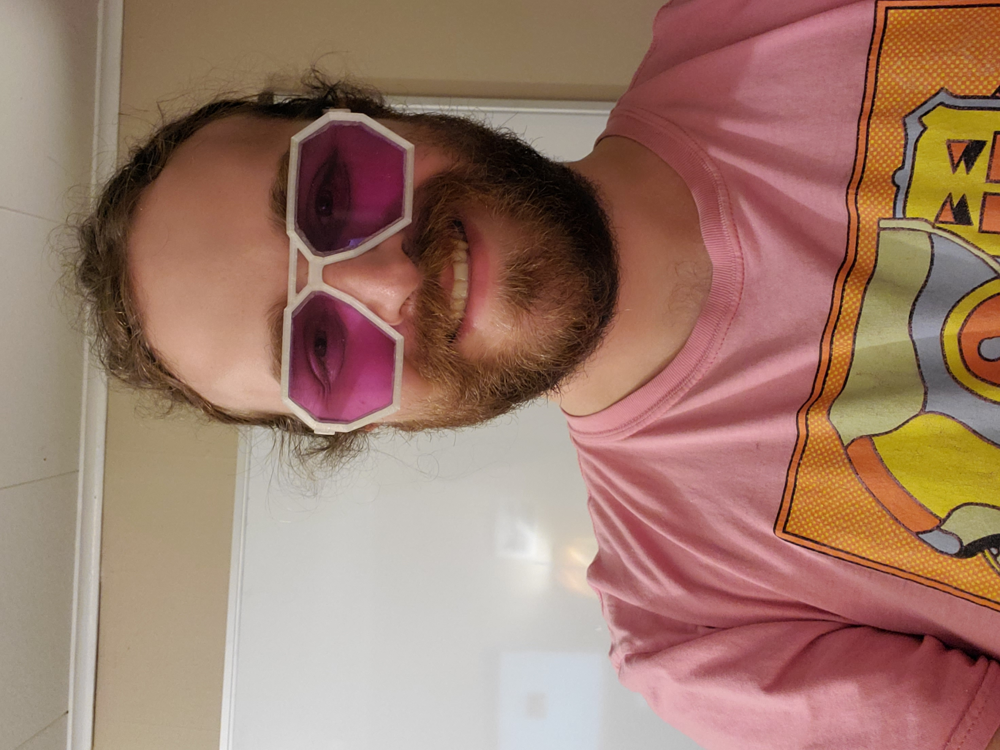

# funky stuff




## Bill of Materials
- [1/8" acrylic sheet](https://www.etsy.com/listing/808658891/transparent-plexiglass-acrylic-sheet?ga_order=most_relevant&ga_search_type=all&ga_view_type=gallery&ga_search_query=polycarbonate+lens&ref=sr_gallery-3-11&bes=1&col=1)
- [Clear PETG](https://www.hatchbox3d.com/collections/shop-all/products/petg-transparent-white-1-75mm-1kg-spool?_pos=2&_fid=dd6b7bb0e&_ss=c)
- 1 vinyl coated paper clip (mine are .6mm radius)
- Equipment
  - Dremel with cutter and sander
  - Lighter
  - Clamps

## Configuring your glasses

1. make a copy of my default config
```shell
cp ./danny-config.scad my-config.scad
```
2. open your config and adjust the parameters to fit your measurements. Measurement instructions are included in the config file 
3. run OpenSCAD with your config
```shell
openscad -o frame.stl ./funkyStuff.scad
openscad -o earpiece.stl ./my-config.scad
openscad -o stencil.stl ./lensStencil.scad 
```

## Printing 

I've included my personal Cura profiles that I've developed during this project. I recommend adjusting the hot end and bed temperatures to match your specific PETG brand. Use either profile for the lens stencil.

### Post-processing

1. Clean and clear the connector holes and their surroundings. Ensuring a good printing profile will minimize the work done here.
2. If you want to curve your earpieces, heat a water bath to 69°C. Submerge the earpieces for 5 minutes. Emerge and shape while they are warm. You can repeat this process until your earpieces are shaped to your liking.

## Lens

### Cutting


### Shaping 
               
1. Clamp the rough cut lens to the edge of the table while shaping.
2. Using the Dremel sander, shape a 50% 45° bevel around the edge of the rough cut acrylic. Flip over lens and repeat on the other side.
3. Try to pop the lens into the frame. Start with the small corner and wrap the frame around the lens. Note which sides of the lens protrude or don't align.
4. Continue shaving misshaped sides and retrying step 2 until you can fit the lens into the frame's inset.

## Assembly

1. Measure and cut your earpiece pins to fit flush within each earpiece
2. Push pin through frame and earpiece
3. You did it! Enjoy your new glasses